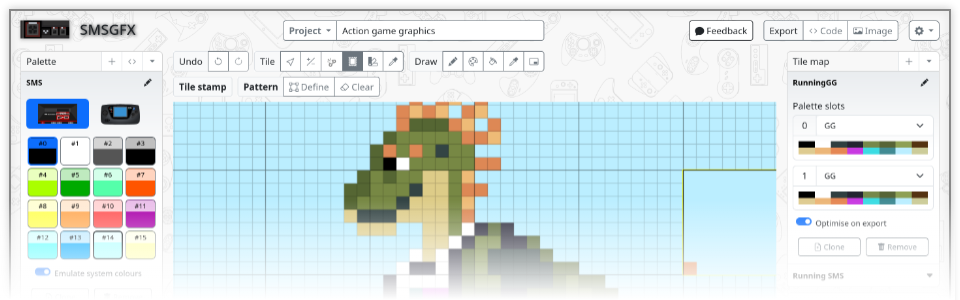

Welcome to SMSGFX!
==================

A browser-based tile editor for making graphics for Sega Master System and 
Sega Game Gear games.

This documentation site will help you get started with the SMSGFX application 
so that you can bring your ideas to life!

What is SMSGFX?
---------------
SMSGFX is tile editor for Sega Master System and Sega Game Gear games.

It runs entirely within your web browser and doesn't require any software
downloads or online cloud accounts to operate.

Using the available tools you can paint up your own tile based graphics, 
create your colour palettes, and then export your work into a format that the 
Sega Master System and Game Gear understands for use in your projects.

If you have an existing game project, or graphics as image files then you can 
also easily bring those graphics into SMSGFX, work with them and then export 
them again for use in your project. 

Projects are automatically saved as you work within your local web browser, with
support for multiple projects that can be worked on concurrently in different 
browser tabs or windows. 

Contents
--------

.. toctree::
   :maxdepth: 2

   quick-overview
   concepts
   interface
   how-to
   functions
   keyboard-shortcuts
