Interface
=========

Main interface
--------------
The SMSGFX interface can be split into four main areas:

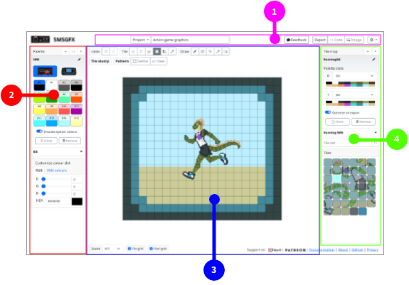

1. **Project toolbar** - Manage your projects, import and export files.
2. **Palette editor** - Create and manage colour palettes.
3. **Tile editor** - Create and edit your graphics tiles.
4. **Tile manager** - Define and manage your tile maps, tile sets and select from the tile palette.

These areas can be further divided as below.

Project toolbar
---------------
The project toolbar allows you to manage your projects, load and save project files, export code and image previews.

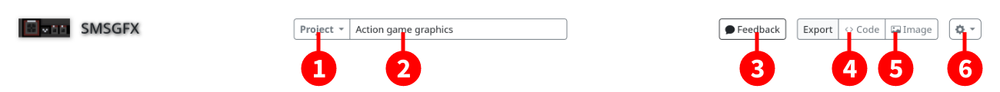

#. Show the **project menu** (see below).
#. **Project name** - Displays the project name, click and type in this field to change the project name.
#. **Feedback button** - Displays a feedback form so that you can leave feedback on this application.
#. **Export code** - Converts the entire project to assembly code and displays it in a window so that you can download it.
#. **Export image** - Download the displayed tile set as a PNG image.
#. Show the **options menu** (see below).

The project menu is where you manage your loaded projects.

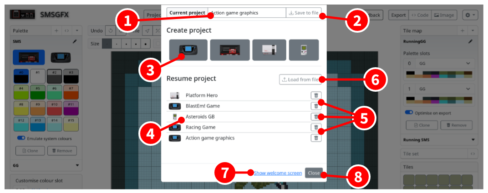

#. **Project name** - Displays the project name, click and type in this field to change the project name.
#. Save the current project as a JSON file.
#. Click your desired system to create a project for that system. The new project window will be shown.
#. **Project list** - Shows all of the projects that are in browser memory, click the title of a project to load it.
#. Remove/delete a project from browser memory (this can not be undone, please save your project as JSON first!).
#. Load a project from a previously exported JSON file.
#. Show the welcome screen.
#. Close the project menu (you can also click outside the project menu or press the `ESC` key.)

The options menu lets you tweak some application settings.

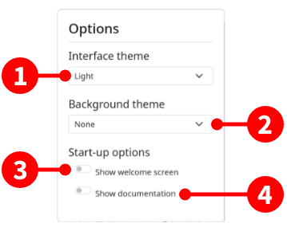

1. **Interface theme** - Change between dark mode, light mode, or automatically use the same theme mode that the system is using.
2. **Background theme** - Show a nice wallpaper behind the work area, or none if you prefer.
3. **Show welcome screen** - When enabled, the welcome screen will always be shown when the application starts.
4. **Show documentation** - When enabled, the documentation pane will always be shown when the application starts.

Palette editor
--------------
The palette editor is where you create and manage your colour palettes.

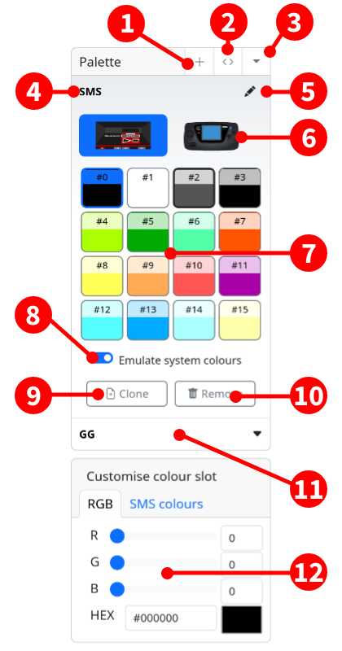

1. Add a new palette with default colours and system selection.
2. Import a colour palette from assembly code.
3. Palette selector drop-down.
4. Selected palette name, click and type into this field to edit.
5. Edit button to change the name of the selected palette.
6. System selection, if the project type allows it, you can choose between systems. Changing this option will affect the exported palette code and also how colours appear in the tile editor.
7. Palette colour slots.
     - Single click a colour slot to select that colour. 
     - Double click a colour slot to display the colour editor window.
     - Currently selected colour is highlighted with a dark outline. 
     - As you move the mouse over the tile editor, the colour index that appears underneath the cursor is given a lighter outline.
8. Enable "Emulate system colours" if you would like to snap colour display to the closest compatible colour for the given system, otherwise the colour will be rendered in the exact R, G, B values you entered.
9. Clone the selected palette.
10. Removes (or delete) the selected palette.
11. Palette selector, other palettes are shown in this list, click their name to edit them.
12. Colour picker, to edit the selected colour index, the available options will depend on the project type.

Tile editor
-----------
Where you create and draw your tiles, or arrange your tile maps.

The editor itself can be split into several sections as below:

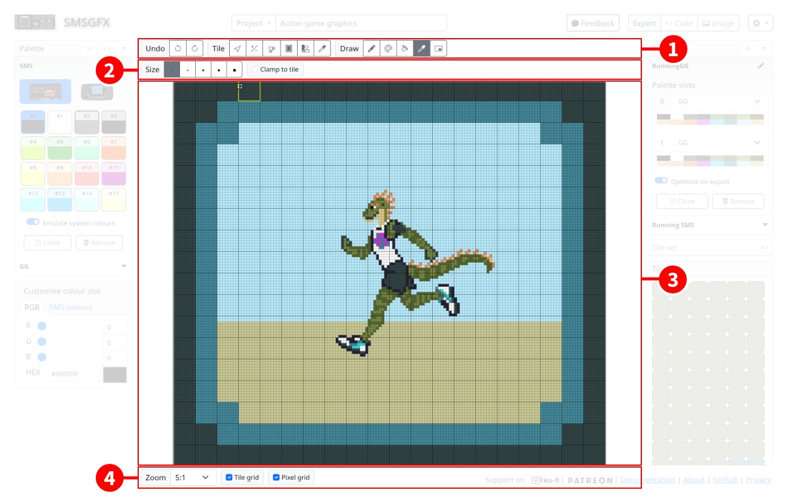

1. **Main toolbar** - Access higher level application functions.
2. **Context toolbar** - Displays contextual functions relating to the selected tool on the main toolbar.
3. **Pixel editor** - graphical editor for previewing and modifying your tiles, or creating a tile map.
4. **View toolbar** - control zoom level, and other display settings.

Each of these areas are explained below.

Tile map editor
---------------

Main toolbar - Tile set mode
~~~~~~~~~~~~~~~~~~~~~~~~~~~~~
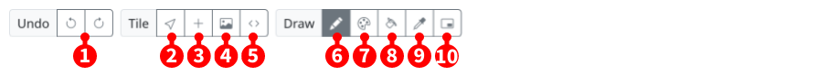

1. **Undo** and **Redo** - Where available, undo your last action or redo an undone action.
2. **Select tool** - Allows you to select individual tiles to perform various functions such as delete, copy, paste, mirror, etc.
3. **New tile** - Adds a new tile to the end of the tileset.
4. **Import image** - Displays the image import dialogue allowing you to select a file form your local hard drive and convert it to a tile set.
5. **Load tiles from code** - Displays a dialogue that allows you to import tiles from assembly code.
6. **Pencil tool** - Draw onto tiles within the tile editor.
7. **Colour replace tool** - Replaces one colour with another.
8. **Fill tool** - Fills/replaces a contigious area of one colour index with another colour index.
9. **Colour select tool** - Select the colour index associated with a pixel on the tile editor.
10. **Reference image tool** - Used to set a background reference image to be displayed within the viewport.

Main toolbar - Tile map mode
~~~~~~~~~~~~~~~~~~~~~~~~~~~~~
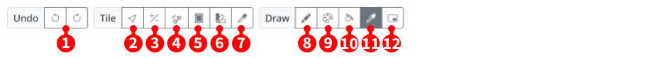

1. **Undo** and **Redo** - Where available, undo your last action or redo an undone action.
2. **Tile attributes tool** - Select a tile within the tile map and apply transformations to it.
3. **Row column mode** - Allows you to add or subtract rows and columns from the tile map.
4. **Break link tool** - If the selected tile is used elsewhere, it creates a clone of that tile.
5. **Tile stamp tool** - Allows you to stamp a tile onto the tile map.
6. **Palette paint tool** - Changes the palette index on tiles that you click.
7. **Tile select tool** - Selects the tile that is referenced in the tile map cell.
8. **Pencil tool** - Draw onto tiles (affects all linked tiles).
9. **Colour replace tool** - Replaces one colour with another (affects all linked tiles).
8. **Fill tool** - Fills/replaces a contigious area of one colour index with another colour index (affects all linked tiles).
9. **Colour select tool** - Select the colour index associated with a pixel on the tile editor.
10. **Reference image tool** - Used to set a background reference image to be displayed within the viewport.

Context toolbar - Select tool (tile set only)
~~~~~~~~~~~~~~~~~~~~~~~~~~~~~~~~~~~~~~~~~~~~~
When the select tool is activated you can click to select individual tiles in the tile set and then perform various operations on the selected tile.
Only available in tile set mode.

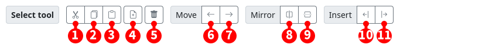

1. **Cut** - Copies the selected tile to the clipboard and then removes it from the tile set.
2. **Copy** - Copy the selected tile to the clipboard.
3. **Paste** - If a tile is in the clipboard it will be inserted into the tile set at the location of the selected tile, if no tile is selected it will be appended to the end of the tile set.
4. **Clone tile** - Creates a copy of the selected tile and then inserts the cloned tile adjacent to the selected tile.
5. **Delete tile** - Removes the selected tile from the tile set.
6. **Move tile left** - Swaps the index of the selected tile with the tile that comes before it.
7. **Move tile right** - Swaps the index of the selected tile with the tile that comes after it.
8. **Horizontal mirror** - Horizontally flips the content of the selected tile.
9. **Vertical mirror** - Vertically flips the content of the selected tile.
10. **Insert before** - Inserts a new blank tile before the selected tile.
11. **Insert after** - Inserts a new blank tile after the selected tile.

Context toolbar - Pencil and replace colour tools
~~~~~~~~~~~~~~~~~~~~~~~~~~~~~~~~~~~~~~~~~~~~~~~~~
Displayed when the pencil tool is activated.

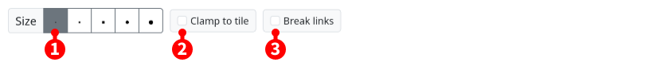

1. **Brush size** - Allows you to choose a brush size.
2. **Clamp to tile** - Limits changes to only within the tile that you clicked on.
3. **Break links** - Tile map only. If you draw onto a tile that is linked to other tiles, that link will be broken so that only the tile that you drew on will be affected.

Context toolbar - Reference tool
~~~~~~~~~~~~~~~~~~~~~~~~~~~~~~~~
Displayed when the reference image tool is activated.

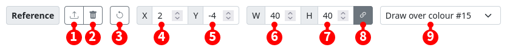

1. **Select reference image** - Displays a file chooser that allows you to choose a reference image to display in the tile editor viewport.
2. **Remove reference image** - Removes the reference image from the viewport.
3. **Revert reference image** - Resets the attributes of the reference image.
4. **X position** - Change the horizontal position of the reference image.
5. **Y position** - Change the vertical position of the reference image.
6. **Image width** - Make the reference image horizontally wider or narrower.
7. **Image height** - Make the reference image vertically taller or shorter.
8. **Maintain aspect ratio** - When resizing the reference image enabling this option will maintain the horizontal or vertical proportions of the reference image.
9. **Display style** - Choose the way in which the reference image is displayed, it can be drawn in-place of a colour, or overlayed over the entire image.

Context toolbar - Tile attributes tool (tile map only)
~~~~~~~~~~~~~~~~~~~~~~~~~~~~~~~~~~~~~~~~~~~~~~~~~~~~~~
This is the toolbar that appears when you select the tile attributes tool while in tile map mode.

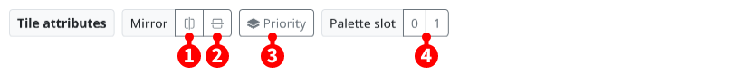

1. **Mirror horizontally** - Sets the mirror horizontal attribute of the tile map tile, when the target system supports it.
2. **Mirror vertically** - Sets the mirror vertical attribute of the tile map tile, when the target system supports it.
3. **Priority** - Sets the priority flag on the tile, making the tile render over sprites, when the target system supports it.
4. **Palette slot** - Change the palette slot that the tile map tile uses.

Context toolbar - Row and column mode (tile map only)
~~~~~~~~~~~~~~~~~~~~~~~~~~~~~~~~~~~~~~~~~~~~~~~~~~~~~~
This is the toolbar that appears when you select the row and column tool while in tile map mode.

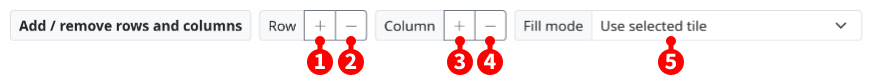

1. **Add row** - Changes to add row mode.
2. **Remove row** - Changes to delete row mode.
3. **Add column** - Changes to add column mode.
4. **Remove column** - Changes to delete column mode.
5. **Fill mode** - When a new row or column is added, this changes the way that adding required tiles to the tile map is handled.

Context toolbar - Tile stamp (tile map only)
~~~~~~~~~~~~~~~~~~~~~~~~~~~~~~~~~~~~~~~~~~~~~~~~~~~~~~
The tile stamp tool is like a paint brush that paints a particular tile onto a tile map.

By default the tile that you've selected in the tile palette is used, but you can also define a tile pattern from other tiles in your tile map.

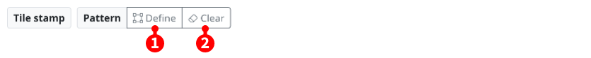

1. **Define pattern** - By default the currently selected tile will be stamped, when you click this button, click into the tile map image and drag to define a pattern to stamp instead.
2. **Clear pattern** - Clears the defined pattern and returns to stamping the selected tile.

Context toolbar - Palette paint (tile map only)
~~~~~~~~~~~~~~~~~~~~~~~~~~~~~~~~~~~~~~~~~~~~~~~~~~~~~~
The palette paint tool is like a paint brush that paints a palette index onto numerous tiles.

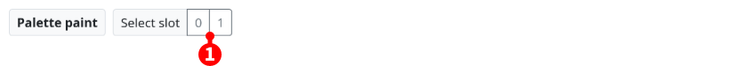

1. **Select slot** - Choose the palette slot that will be assigned to tiles as you paint over them.

Context toolbar - View toolbar
~~~~~~~~~~~~~~~~~~~~~~~~~~~~~~
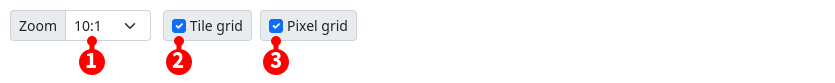

1. **Zoom level** - Change the size of the image displayed in the viewport.
2. **Show tile grid** - When enabled a border will be drawn around each 8x8 pixel tile.
3. **Show pixel grid** - When enabled a border will be drawn around each individual pixel.
